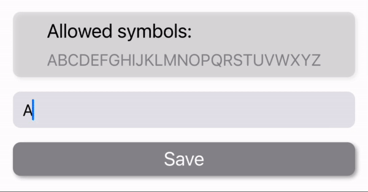

# Custom TextField with throws and clean button!

A simple example of the custom ProgressBar with a vertical Divider!



# Using
```swift
DefaulTextfield(placeholder: "test",
                            text: $text,
                            isValid: $isValid,
                            minLenght: 3,
                            maxLenght: 6,
                            allowedSymbols: "ABCDEFGHIJKLMNOPQRSTUVWXYZ")
```
